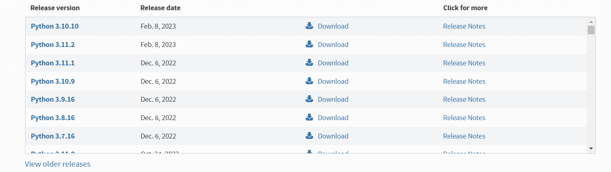
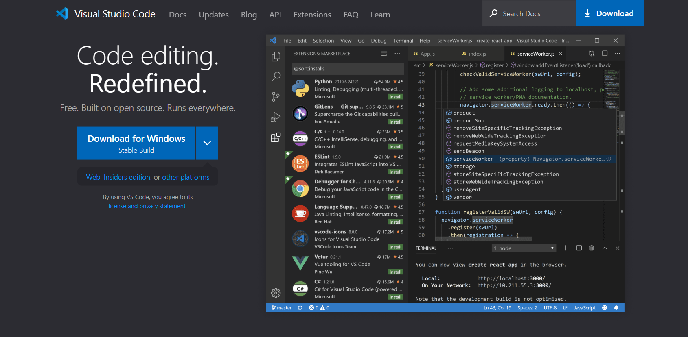
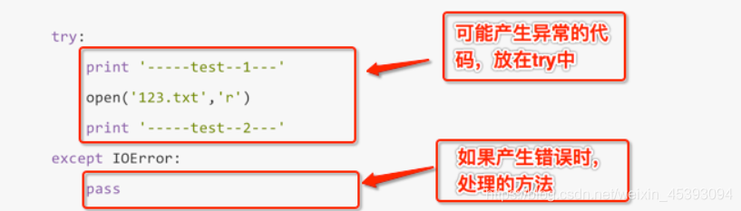
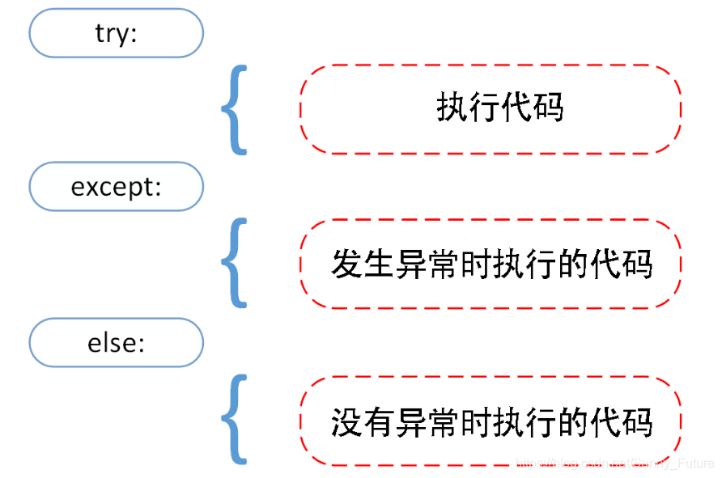
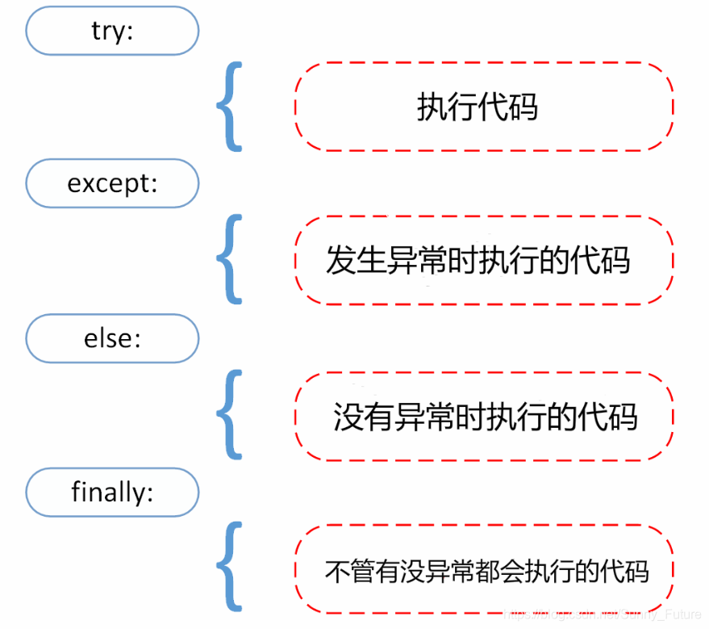

# Python 基础教程 Notes

## chapter0 python 解释器下载及开发环境配置

开发环境（ide）=Py解释器+文本编辑器+配置系统环境变量

​	[Python解释器下载地址](https://www.python.org/downloads/)		

[文本编辑器 VsCode](https://code.visualstudio.com/)



[环境变量配置与VsCode配置](https://blog.csdn.net/Zhangguohao666/article/details/105040139?ops_request_misc=%257B%2522request%255Fid%2522%253A%2522167732779116800211561858%2522%252C%2522scm%2522%253A%252220140713.130102334..%2522%257D&request_id=167732779116800211561858&biz_id=0&utm_medium=distribute.pc_search_result.none-task-blog-2~all~baidu_landing_v2~default-4-105040139-null-null.142^v73^control_1,201^v4^add_ask,239^v2^insert_chatgpt&utm_term=py%20vscode&spm=1018.2226.3001.4187)

## chapter1 基础知识

### 1.1  交互式解释器

当我们在终端启用python 后我们可以看到下列的提示符

```py
PS C:\Users\86152> python
Python 3.10.10 (tags/v3.10.10:aad5f6a, Feb  7 2023, 17:20:36) [MSC v.1929 64 bit (AMD64)] on win32
Type "help", "copyright", "credits" or "license" for more information.
>>>
```

`>>>`是提示符，可以在它的后面输入一些内容。例如，如果你输入`print("hello,world!")`并按回车，python解释器将打印字符串`“hello,world！”` 

```py
>>> print("hello,world!")
hello,world!
>>>
```

### 1.2  数和表达式

1. 数据类型：

	* 整型 int 

	* 浮点型 float

	* 布尔值 bool 

2. 运算符：` + - * / %  **`

```py
# + - * 对整型数据的运算结果依然是整形 

# / 对整型数据运算的结果是浮点数 
>>> 1/2
0.5
>>>1/1
1.0
#如果想要丢弃小数部分 执行整除运算 可以使用 //
>>>1//2
0
>>>1//1
1
>>>5.0//2.4
2.0

# 取余（求模）运算  %    x%y 等价于 x-((x//y)*y)
>>>1%2
1
>>>2.75%0.5
0.25

# 幂运算 **   (a**n)  a的n次幂
>>>2**3
8
```

3. 十六、八、二进制

```py
#十六
>>>0xAF
175
#八
>>>010
8
#二
>>>0b1011010010
722
```

### 1.2  变量

* 变量表示（或指向）特定值的名称。变量的==命名只能由字母、数字、下划线构成 ，数字不能打头。==

* python 的变量不需要声明，但在使用前必须赋值

```py
>>>x=3
>>>x*2
6
print(a) #a 未赋值 报错
```

### 1.4  用户输入 input()

```py
>>>input("how old are you ?")
how old are you ? 5
'5'
```

​		这里在交互式解释器中执行了第一行代码`input("how old are you ?")` 我们按按时输入`5 `按回车，这个数被input以文本或字符串的方式返回。这里我们可以使用``int()`` 实现类型转换

```py
>>>int(input("how old are you ?"))
how old are you ? 5
5
```

### 1.5  模块

​		可将模块视为拓展（或者熟悉的c++ 库），将其导入可以拓展python的功能。导入模块的命令 `import`

```py
>>>import math
>>>math.floor(32.9)
32
```

​		原理 我们使用import 导入模块 ，再以`module.function`的方式使用模块中的函数 。 一个模块中可能有多个函数 当我们导入多个模块时 这些模块里可能有同名的函数。`module.function`的方式可以避免冲突。当我们确定不会从不能的模块导入多个同名函数时，我可能不想每次调用函数都指定模块名。我们可以使用`import`的变种 `form module import function` 在调用`function`时我们就可以不用指定`module`

### 1.6  cmath和复数

​		函数`sqrt`用于计算算数平方根 函数定义于`mach`模块。

```py
>>>from math import sqrt
>>>sqrt(-1)
Traceback (most recent call last):
  File "<stdin>", line 1, in <module>
ValueError: math domain error
#在有些平台上
>>>sqrt(-1)
nan # nan(not a number)
```

​		显然用`math.sqrt()`无法实现复数的计算，为此python标准库提供了专门的模块进行处理  `cmath`

```py
>>> import cmath
>>> cmath.sqrt(-1)
1j
>>>
```

1j是个虚数，虚数都以`j`(或 `J`)结尾

```py
>>> (1+3j)*(9+4j)
(-3+31j)
>>>
# 从这里我们可以看出Python本身提供了对复数的支持
```

### 1.7  注释

​		python 使用`#`进行单行注释注释 `#`到行尾部的内容都将被注释掉，python 使用三个单引号`''’`  ` '''` 进行多项注释 引号间的内容本质时未使用的长字符串

### 1.8  字符串

#### 1.8.1 单引号字符串以及对引号的转义

​		python 的字符串既可以用单引号也可以用双引号表示 ，但不能混用。看下面几个例子就可以理解其中原因

```py
>>>"hello,world!"
'hello,world!' 

>>>'hello,world!'
'hello,world!'
#下面这个例子你就可以理解  python 的字符串既可以用单引号也可以用双引号表示
>>>"let's go!"
"let's go!"
>>>'"hello,world!" she said'
'"hello,world!" she said'

>>>'let's go'
SytaxError: invalid syntax  #这里解释器只能将'let' 识别为字符串 后面的不知道怎么处理

#解决办法是加双引号 也可以使用 \ 进行转义
>>>'let\'s go' #这样python 将明白中间的引号是字符串的一部分，而不是字符串的结束。但解释器采用了 双引号的处理手法
"let's go"
```

#### 1.8.2  拼接字符串

```py
#第一种
>>>"hello,"+"world"
'hello,world'
#第二钟
>>>x="hello,"
>>>y="world"
>>>x+y
'hello.world'
```

#### 1.8.3 字符串表示`str`和`repr`

```py
>>>"hello,world!"
'hello,world!'
>>>print("hello,world!")
hello,world!

>>>"hello,\nworld!"
'hello,\nworld!'
>>>print("hello,\nworld!")
hello,
world!
```

通过两种不同的机制将值转换成了字符串。可通过使用函数`str`函数和`repr`函数直接使用这两种机制。使用`str`能以合理的方式将值转换为用户能够看得懂的字符串。使用`repr `时，通常会获得值的合法python表达式

```py
>>>print(repr("hello,\nworld!"))
'hello,\nworld!'
>>>print(str("hello,\nworld!"))
hello,
world!
```

#### 1.8.4 长字符串、原始字符串和字节

###### 1.8.4.1 长字符串

要表示很长的字符串（跨很多行的字符串），可以使用三引号`'''`  

```py
print('''hello,
this
is 
python''')

```


## chapter2 列表和元组  list&tuple

​		本章介绍一个不是新的的新概念：**数据结构** 。数据结构是以某种方式组织起来开的数据元素集合。在python中最基本的数据结构就是**序列（sequence）**。

### 2.1序列概述

​		python内置了多种序列，本章讨论最常见的两种：**列表和元组**。另一种重要的序列**字符串**将在下一张详细的讨论。

​		列表与元组和主要区别在于，列表可以修改元素，元组不能修改元素。

### 2.2 序列的通用操作

​		有几种操作适用于所有序列：

* 索引
* 切片
* 相乘
* 成员资格检查

#### 2.2.1 索引

​		序列中的所有元素都是编号的——从0开始递增。**索引**（indexing）可以用访问取相应位置的元素。

```py
>>>gretting="hello,world!"
>>>gretting[0]
'h'
>>>gretting[-1]  #使用负索引，python将从右（最后一个元素）开始往左数，[-1]就是最后一个元素
'!'
>>>'hello'[1]
'e'
>>>fourth=input("Year:")[3]
Year:2023
>>>fourth
'3'
```

#### 2.2.2 切片

​		索引只能访问单个元素，而**切片**（slicing）可以访问特定范围内的元素。方法`[indexing:indexing]`。
P.S.  ==区间是左闭右开== 即`[indexing:indexing)`。 更详细一点，第一个索引是包含第一个元素的编号，但第二个索
引是切片后余下的第一个元素的编号

```py
>>>numbers=[1,2,3,4,5,6,7,8,9,0]
>>>numbers[3:6]
[4,5,6]
#这里的索引10是指的第11个元素，但它并不存在，但确实到达了最后一个元素后在前进一步的位置。
>>> numbers[0:10]
[1, 2, 3, 4, 5, 6, 7, 8, 9, 0]
#同样切片可以使用负索引
>>>numbers[-3:-1]
[8,9]
#切片始于开头，可以省略第一个索引
>>>numbers[:3]
[1,2,3]
#切片结束于列表尾部，可以省略最后一个索引
>>>numbers[-3:]
[8,9,0]
#想要复制整个序列，可以将两个索引都省略掉
>>>numbers[:]
[1,2,3,4,5,6,7,8,9,0]
#当然正负索引可以混合使用，但要注意索引的位置
>>> "hello,world"[1:-1]
'ello,worl'
>>> "hello,world"[-1:1]  #切片是从左往右切，这里索引位置错误
''
>>> "hello,world"[-7:9]
'o,wor'
>>>
```

​		切片可以控制步长，上面的切片操作我们的省略了步长。上面的步长默认为 `1` 我们可以指定步长`[0:10：2]`
步长`2`指的 从**起点到终点每隔==一==个元素提取一个元素**，步长`3`   **起点到终点每隔==两==个元素提取一个元素**

```py
>>>numbers=[1,2,3,4,5,6,7,8,9,0]
>>>numbers[0:10,2]
[1,3,5,7,9]
>>>numbers[0:10,3]
[1, 4, 7, 0]
```

​		步长不能为`0` 但可以为负数，即从右向左提取元素

```py
>>>numbers=[1,2,3,4,5,6,7,8,9,0]
>>>numbers[8:3,-1]
[9,8,7,6,5]
>>>numbers[10:0:-2]
[0,8,6,4,2]
>>>numbers[0:10:-2]
[]
>>>numbers[::-2]  
[0,8,6,4,2]
>>>numbers[5::-2]
[6,4,2]
>>>numbers[:5:-2]
[10,8]
```

​		仔细观察上面的例子你会发现其中的规律，这种情况下正确的提取元素还是要颇费思量的。步长为负，第一个索引必须比第二个索引da。

#### 2.2.3 序列相加

​		序列可以使用`+`运算符来进行拼接

```py
>>>[1,2,3]+[4,5,6]
[1,2,3,4,5,6]
>>>'hello,'+"world!"
'hello,world!'
>>>[1,2,3]+"hello"
Traceback (most recent call last):
  File "<stdin>", line 1, in <module>
TypeError: can only concatenate list (not "str") to list
>>>
```

​		列表不能拼接字符串，因为他们都是序列。一般而言，不能拼接不同类的序列

#### 2.2.4 乘法

​		将序列与数`x`相乘时，python将重复这个序列`x`次来创造一个新的序列：

```py
>>>"python"*5
'pythonpythonpythonpythonpython'
>>> [42]*10
[42, 42, 42, 42, 42, 42, 42, 42, 42, 42]
```

 		==None、空列表和初始化==

​		空列表不包含任何元素用 `[]`表示 ，如果要创建包含10个元素，但里面没有任何内容的列表我们可以使用`None` 

```py
>>> [None]*10
[None, None, None, None, None, None, None, None, None, None]
```

#### 2.2.5 成员资格

​		要检查特定的值是否在序列中，可以使用运算符`in`，这个运算符 检查特定的条件是否满足 返回一个`bool`值，这个运算符称为布尔运算符。

```py
>>> 'hello,' in 'hello,world'
True
>>> "helo"in "hello,world"
False
```

​		**长度、最大值和最小值**

​		内置函数`len 、min 、max` 分别返回序列的元素个数、序列中的最大值、最小值。

```PY
>>> numbers=[1,2,2,4,6]
>>> len(numbers)
5
>>> max(numbers)
6
>>> min(numbers)
1
```

### 2.3 列表：python的主力

​		前面以及介绍过序列的通用方法，这里介绍列表的特有方法

#### 2.3.1 函数 list

​		由于字符串是不可以修改的，`list` 可以帮助我们使用字符串来创建列表

```py
>>> list("hello,world!")
['h', 'e', 'l', 'l', 'o', ',', 'w', 'o', 'r', 'l', 'd', '!']
```

==P.S. 可以将任何序列作为`list`的参数==

#### 2.3.2 基本的列表操作

```py
# 修改列表：给元素赋值
>>>x=[1,2,3,4]
>>>x[0]=0
>>>x
[0,2,3,4]

#删除元素
>>>names=["JJ","mac","hello"]
>>>del names[0]
>>>names
['mac','hello']

#给切片赋值
>>>names=list('perl')
>>>names
['p','e','r','l']
>>>names[2:]=list('ar')
>>>names
['p','e','a','r']

#切片赋值还可以在不替换原有元素的情况下插入新元素
>>>numbers=[1,5]
>>>numbers=[1:1]=[2,3,4]   #这里“替换”了一个空的切片，相当于插入了一个序列。
>>>numbers
[1,2,3,4,5]   
#我们可以采用相反的操作删除切片
>>>numbers=[1,2,3,4,5]
>>>numbers[1:4]=[]
>>>numbers
[1,5]
```

#### 2.3.3 列表方法

​		方法是与对象（列表、数、字符串等）紧密联系的函数。调用方法`object.method(arguments)` 下面介绍列表的几种方法

##### append

```py
>>>lst=[1,2,3]
>>>lst.append(4)
>>>lst
[1,2,3,4]
```

##### clear

```py
>>>lst=[1,2,3]
>>>lst.clear()
>>>lst
[]
```

##### copy

```py
>>>a=[1,2,3,4]
>>>b=a    #这样操作a 和 b 还是同一个列表无法完成复制
#方法1 使用copy
>>>b=a.copy()
>>>b
[1,2,3,4]
#方法2 使用切片
>>>b=a[:]
>>>b
[1,2,3,4]
```

##### count

```py
>>>['to','be','or','not','to','be'].count('to')
2
>>>x=[[1,2],1,1,[2,1[1,2]]]
>>>x.count[1]
2
>>>x.count([1,2])
1
```

##### extend	

​		可以同时将多个附加到列表末尾，为此可将这些值组成的序列作为参数提供给`extend`

```py
>>>a=[1,2,3]
>>>b=[4,5,6]
>>>a.extend(b)
>>>a
[1,2,3,4,5,6]

#这种方法可能看起来类似于拼接，但存在重要的却别，那就是可以修改被扩展的序列（a）,在常规的拼接中返回的是一个全新的序列。
>>>a=[1,2,3]
>>>b=[4,5,6]
>>>a+b
[1,2,3,4,5,6]
>>>a
[1,2,3]
#要修改a 只能 a=a+b
>>>a=a+b
>>>a
[1,2,3,4,5,6]
#这种方法的效率就要比 a.extend(b)的方法低
#还有一种方法使用切片
>>>a=[1,2,3]
>>>b=[4,5,6]
>>>a[len(a):]=b
>>>a
[1,2,3,4,5,6]
#但这种方法的可读性比较低
```

##### index 

​		查找指定值第一次出现的位置

```py
>>>knights=['we','are','the','knights','who','say','ni']
>>>knights.index('who')
4

>>> knights=['we','are','the','knights','who','say','ni']
>>> knights.index('herring')
Traceback (most recent call last):
  File "<stdin>", line 1, in <module>
ValueError: 'herring' is not in list
```

##### insert		

​		使用格式`insert(indexing,object)`

```pu
>>>nummbers=[1,2,3,4,5,6,7]
>>>numbers.insert(2,'four')
>>>numbers
[1,2,3,'four',4,5,6,7]
```

##### pop		

​		`pop(indexing)`从列表删除末尾一个元素，并返回这一值

```py
>>>x=[1,2,3]
>>>x.pop()
3
>>>x
[1,2]
>>>x.pop(0)
1
>>>x
[2]
```

##### remove 		

​		删除第一个为指定值的元素。

```pu
>>>x=['to','be','or','not','to','be']
>>>x.remmove('to')
>>>x
['be','or','not','to','be']

>>> ['to','be','or','not','to','be'].remove('bee')
Traceback (most recent call last):
  File "<stdin>", line 1, in <module>
ValueError: list.remove(x): x not in list
>>>
```

##### reverse		

​		按相反的顺序排序列表中的元素

```py
>>>x=[1,2,3]
>>>x.reverse()
>>>x
[3,2,1]
```

##### sort	

​		`sort()` 用于对列表就地排序。就地排序就意味着对原列表进行修改，使其元素按序排列，而不是返回排序后的列表副本。

```py
>>> x=[2,3,4,6,32,2,3,4,687]
>>> x.sort()
>>> x
[2, 2, 3, 3, 4, 4, 6, 32, 687]

# 内置函数 sorted()
>>> x=[6,5,34,32,6]
>>> y=sorted(x)
>>> x
[6, 5, 34, 32, 6]
>>> y
[5, 6, 6, 32, 34]
# 这个函数适用于任何序列，但总是返回一个列表
>>> sorted("hello")
['e', 'h', 'l', 'l', 'o']
>>>
```

##### 高级排序

​		方法`sort()`接受两个可选参数：`key`和`reverse` 。这两个参数通常是按名称指定的，称为关键字参数。参数key 类似于参数cmp(compare)  ：设置一个用于排序的函数。

```py
# 根据元素长度对元素进行排序，可将参数设置成函数len
>>>x=['aardvark','abalone','acme','add','aerate']
>>> x.sort(key=len)
>>> x
['add', 'acme', 'aerate', 'abalone', 'aardvark']
>>>

```

​		对于另一个参数`reverse` ,只需将其指定为一个真值（`True` 或者`False`）以指出是否要按相反的序列排序

```py\
>>> x=[4,6,2,1,7,9]
>>> x.sort(reverse=True)
>>> x
[9, 7, 6, 4, 2, 1]
>>>
```

### 2.4 元组：不可修改的序列

​		元组于列表的唯一区别在于元组不能修改元素。

```py
#创建方法 用逗号隔开
>>>1,2,3
(1,2,3)
# 常用方法用圆括号括起来
>>>(4,5,6)
(4,5,6)
# 空元组
>>>()
()
#只含有一个元素的元组  要加上一个逗号
>>>2,
(2,)
>>>(2,)
(2,)

#函数tuple  将序列转化为元组
>>> tuple([1,2,3,4])
(1, 2, 3, 4)
>>> tuple("hello")
('h', 'e', 'l', 'l', 'o')
>>>
```

## chapter3 字符串 str

​		字符串也是序列，所有标准的序列操作都适用于字符串，但字符串是不可变的，所有的元素赋值和切片赋值都是非法的。本章主要介绍如何使用字符串来设置其他格式，并大致了解使用字符串方法可完成的重要任务，如拆分、合并、查找。

### 3.1 字符串转义

​		转义的语法：一个`\`+单个字符，组合后单个字符失去原来字面意义，会被赋予一个新的功能。

​		转义字符`\`可以转义很多字符，比如`\n`表示换行制表符，字符`\`本身也要转义，因此`\\`就表示`\`。

| 转义字符 |                 意义                  |  ASCII码   |
| :------: | :-----------------------------------: | :--------: |
|   `\a`   |              响铃（BEL）              |    007     |
|   `\b`   |    退格（BS），将当前位置下移一列     |    008     |
|   `\f`   | 换页（FF），将当前位置移到下一页开头  |    012     |
|   `\n`   | 换行（LF），将当前位置一道下一行开头  |    010     |
|   `\r`   |  回车（CR），将当前位置移到本行开头   |    013     |
|   `\t`   | 水平制表（HT），（跳到下一个TAB位置） |    009     |
|   `\v`   |            垂直制表（VT）             |    011     |
|   `\\`   |          代表一个反斜线字符           |    092     |
|   `\'`   |          代表一个单引号字符           |    039     |
|  `\''`   |          代表一个双引号字符           |    034     |
|   `\?`   |             代表一个问号              |    063     |
|   `\0`   |            空字符（NULL）             |    000     |
|  `\ddd`  |     1~3位八进制数所代表的任意字符     | 三位八进制 |
|  `\xhh`  |       十六进制所代表的任意字符        |  十六进制  |


### 3.2  设置字符串的格式

​		将字符串中的一部分替换为具备某种格式的变量，称为字符串的格式化。

#### 3.1.1 使用%占位符

```py
>>>age = 23
>>>name = 'tom'
>>>'Happy birthday %d, %s!'%(age, name)
'Happy birthday 23, JJ!'
```

占位符合集

| %c   | 单个字符，或将表示字符的Unicode转换为字符替换进来 |
| :--- | :-----------------------------------------------: |
| %S   |                      字符串                       |
| %d   |                       整数                        |
| %u   |                    无符号整数                     |
| %b   |                     二进制数                      |
| %o   |                     八进制数                      |
| %x   |                    十六进制数                     |
| %X   |               字母大写的十六进制数                |
| %f   |                      浮点数                       |
| %e   |              科学计数法表示的浮点数               |
| %E   |         使用大写的E表示的科学计数法浮点数         |
| %g   |     综合的%e和%f，系统决定是否使用科学计数法      |
| %G   |                   大写表示的%g                    |

在%和占位字符之间，可以加入数字和其他符号来表示更详细的格式控制。

其中，数字表示要预留多少字符的位置给这个数值，小数点加数字表示小数的位数。（如果实际长度不足，会在左边用空格填充，如果实际长度超出，则不会进行裁剪而直接输出。这里控制格式的数字必须是整数，或者使用’*’表示格式控制数字由后面的参数提供。）
```py
>>>'%3d'%11
' 11'
>>>'%.2f'%(1/3)
'0.33'
>>>'%.*f'%(3, 3.14159)
'3.142'
```

%和占位字符之间，还可以表示4种内容。’-’表示向**左对齐**即在后面而不是前面填充空位，’0’表示用**0填充**而不是空格，’+’表示正数也要’+’表示**符号**，' '空格表示在正数前不用’+’表示符号，而是用**空格**，用来和负数对齐。

```py
>>>'%-3d'%11
'11 '
>>>'%03d'%11
'011'
>>>'%+3d'%11
'+11'
>>>'% 3d'%11
' 11'
```

#### 3.1.2  format()

​		和字符串的格式化格式不同，format函数使用{}表示占位符, 一般格式为:

​	                                       	`{<索引>:<填充字符><对齐方式><宽度.精度><格式>}`

```py
>>>'A{}, B{}'.format('a', 'b')
'Aa Bb'
>>>'索引示例: A{1}, B{0}'.format('b', 'a')
'索引示例: Aa, Bb'
>>>'*填充,右对齐: {0:*>3d}'.format(11)
'*填充,右对齐: *11'
>>>'*填充,左对齐: {0:*<3d}'.format(11)
'*填充,左对齐: 11*'
```

#### 3.1.3  `f'str'`

​		可以使用在字符串前加f的方式表示格式化字符串，从而可以在字符串内部直接使用{变量}的形式来进行格式化操作。

```py
>>>age = 23
>>>name = 'tom'
>>>f'Happy birthday {age}, {name}!'
'Happy birthday 23, tom!'
```


### 3.3  字符串方法

#### 3.2.1  center

​		center 通过在两边添加字符（默认空格）让字符串居中

```py
>>> "hello,world".center(22)
'     hello,world      '
>>> "hello,world".center(39)
'              hello,world              '
>>> "hello,world".center(39,"*")
'**************hello,world**************'
>>> "hello,world".center(33,"*")
'***********hello,world***********'
```

#### 3.2.2  find

​		在字符串中查找子串。找到返回第一个字符的索引，找不到返回-1

```py
>>> 'with a moo-moo here,and a moo-moo there'.find('moo')
7
>>> title="MOnty Python's Flying Cirus"
>>> title.find('Monty')  #原版 O  查找 o
-1
>>> title.find('Python')
6
#  find("object",begin,end)  还可以指定查找的范围
>>> title.find('Python',1)
6
>>> title.find('Python',7)
-1
>>> title.find('Python',1,7)
-1
```

#### 3.2.3  join

​		`join` 与`split` 相反 ，用于合并序列的元素  

```py
>>> seq=[1,2,3,4,5]
>>> sep='+'
>>> sep.join(seq)
Traceback (most recent call last):
  File "<stdin>", line 1, in <module>
TypeError: sequence item 0: expected str instance, int found
>>> seq=['1','2','3','4','5']
>>> sep.join(seq)
'1+2+3+4+5'
>>>
```

#### 3.2.4 lower

​		返回字符串的小写版本

```py
>>> "HELLO,WORLD".lower()
'hello,world'
>>>
```

请自行学习 `islower` `istitle` `isupper` `translate` 

#### 3.2.5  replace  

​		将指定的子串都替换为另一个子串，并返回结果

```py
>>> 'this is s test'.replace('is','haha')
'thhaha haha s test'
>>>
```

#### 3.2.6  split

​		`split` 与 `join` 相反 ，用于将字符串拆分为序列。

```py
>>> '1+2+3+4+5'.split('+')
['1', '2', '3', '4', '5']
>>> '/usr/bin/env'.split('/')
['', 'usr', 'bin', 'env']
>>> 'using the default'.split()  #没有指定空格符，将默认在单个或连续多个的空白符（空格、制表符、换行符）处拆分
['using', 'the', 'default']
>>>
```

#### 3.2.7  strip

​		将字符串开头末尾的空白（不包括中间的空白）删除，并返回删除后的结果 		自行了解`lstrip` `rstrip`

```py
>>> center='hello,world'.center(22)
>>> center
'     hello,world      '
>>> center.strip()
'hello,world'
>>>
```

#### 3.2.8  translate

​		`translate` 与  `replace` 一样替换字符串特定部分，但不同的是他只能进行单字符的替换。`translate` 的优势在于能够同时替换多个字符，效率比`replace`  高。

​		语法： 

```py
table=str.maketrans('','')
str.translate(table)
```

​		参数：

* table  翻译表，通过`maketrans()` 转换来 	

```py
>>> table=str.maketrans('cs','kz')
>>> table
{99: 107, 115: 122}
>>> 'this is an incredible test'.translate(table)
'thiz iz an inkredible tezt'
```


#### 3.2.9  判断字符串是否满足特定条件

​		很多字符串方法都是以 is 打头 ， 如 `isspace`  	`isdigit`  `isupper` 他们判断字符串是否具有特定的性质（如包含的字符全为空白、数字、大写），返回一个**布尔值** 。请自查 	`isalnum` `isalpha` `isdecimal` `isdigit` `isidentifier` `islower` `isnumeric` 
`isprintable` `isspce` `istitle` `isupper`

## chapter4  字典 dict

​		这里我们学习另一种数据结构：字典。字典以键值对的方式存储数据，字典是一个无序的序列。（列表是有序的）

### 4.1  创建和使用字典

​		语法格式  `{key:value,key:value,......}`  。表示方法  `phonebook={'Alice':23254,'Beth':20222}`

​		字典由`键–值` 组成，键值对称为**项(item)**， 键和值用`:` 分隔开；项之间用`,` 分隔。而整个字典包含在`{}` 里面，空字典用`{}` 表示，P.S.  在字典中，键必须是独一无二的，值不需要这样。字典中的键(key)只能使用不可变数据类型，字典的值(value)可以是数、字符串、列表乃至字典。

```py
>>> phonebook={'Alice':23254,'Beth':20222}
>>> phonebook['Alice']
23254
>>> phonebook['Beth']
20222
#键是不可变数据类型
>>> d = {'name':'Amei'}
>>> d[1] = '我是1'
>>> d
{'name': 'Amei', 1: '我是1'}
>>> 
d[(2,)] = '我是元组'
>>> d
{'name': 'Amei', 1: '我是1', (2,): '我是元组'}
#键是可变数据类型
>>> d[[3]] = '我是列表'
Traceback (most recent call last):
  File "<pyshell#6>", line 1, in <module>
    d[[3]] = '我是列表'
TypeError: unhashable type: 'list'

```

#### 4.1.1  函数dict

​		可以使用函数`dict` 从其他映射（其他字典）或键值对序列创建字典

```py
>>> items=[('name','JJ'),('age','19')]
>>> itm=dict(items)
>>> itm
{'name': 'JJ', 'age': '19'}
#还可以使用关键字实参来调用这个函数
>>> dic=dict(name='JJ',age=19)
>>> dic
{'name': 'JJ', 'age': 19}
>>>
```

#### 4.1.2  基本的字典操作

* `len(d)`  返回字典`d` 包含的项数
* `d[k]`  返回关联的值
* `d[k]=v` 将`v` 关联到 `k` 上
* `del d[k]`  删除键为`k` 的项
* `k in d` 检查`d` 中是否包含键为`k` 的项

* 键的类型：键必须是不可变类型，例如：数、字符串、元组
* 自动添加：即便是字典中没有的键，也可以赋值，这将创建以一个新的项。

#### 4.1.3  将字符串格式设置功能用于字典

#### 4.1.4  字典方法

##### clear

​		删除所有的项，就地执行，不返回任何东西（或者返回None）

```py
>>> x={}
>>> y=x		#简单的用等号赋值 y和x 都指向同一个字典
>>> x['key']='value'
>>> y	
{'key': 'value'}
>>> x={}  #这里x指向了另一空字典 对x的操作对y不会由影响
>>> x
{}
>>> y
{'key': 'value'}
>>> x["keYYY"]="valuEEE"
>>> x
{'keYYY': 'valuEEE'}
>>> y
{'key': 'value'}
>>>
>>> x.clear()
>>> x
{}
>>> y
{'key': 'value'}
```

##### copy

​		方法`copy` 返回一个新的字典，其包含的键值对与原来的字典相同 （这个方法是一个**浅复制**，因为值本身是原件，而非副本）

```py
>>> x={'username':'admin',"machines":['foo','bar','baz']}
>>> x
{'username': 'admin', 'machines': ['foo', 'bar', 'baz']}
>>> y=x.copy()
>>> y
{'username': 'admin', 'machines': ['foo', 'bar', 'baz']}
>>> y['username']='mlh'   #替换副本的值，原件不受影响。
>>> y['machines'].remove('baz')  #修改副本的值（就地修改而不是替换），原件的也会改变，因为原件指向的也是被修改的值
>>> y
{'username': 'mlh', 'machines': ['foo', 'bar']}
>>> x
{'username': 'admin', 'machines': ['foo', 'bar']}
>>>
```

​		为了避免这种问题，我们可以使用`copy` 模块中的`deepcopy` 函数 ，同时复制值及包含的所有值。

```py
>>> from copy import deepcopy
>>> x={'username':'admin',"machines":['foo','bar','baz']}
>>> y=deepcopy(x)
>>> y['machines'].remove('baz')
>>> x
{'username': 'admin', 'machines': ['foo', 'bar', 'baz']}
>>> y
{'username': 'admin', 'machines': ['foo', 'bar']}
>>>

```

##### fromkeys

​		方法`fromkeys` 创建一个新字典，并指定键，且每个键对应的值都为 None

```py
>>> dict.fromkeys(['name','age'])
{'name': None, 'age': None}
>>> {}.fromkeys(['name','age'])
{'name': None, 'age': None}
```

##### get

​		方法`get`访问不存在的键时，返回None。访问存在的键时，返回其指向的值 

```py
>>> d={}
>>> print(d.get('name'))
None
>>> d={'name':'JJ'}
>>> d.get('name')
'JJ'
```

##### items

​		方法`item` 返回一个包含所有项的列表，没有元素以`(key,value)` 形式，字典的项在列表中的排列是不定的。

```py
>>> d={'name':'JJ','age':19,'sex':'male'}
>>> d.items()
dict_items([('name', 'JJ'), ('age', 19), ('sex', 'male')])
>>>
```

​		返回值属于一种 **字典视图**的数据类型。

##### keys

​		方法`keys` 返回一个字典视图，其中包含指定字典中的键

```py
>>> d={'name':'JJ','age':19,'sex':'male'}
>>> d.keys()
dict_keys(['name', 'age', 'sex'])
```

##### pop

​		方法`pop` 可以用于获取与指定键关联的值，并删除该键值对

```py
>>> d={'x':1,'y':2}
>>> d.pop('x')
1
>>> d
{'y': 2}
```

##### setdefault

##### values

​		方法`values` 返回一个字典视图，其中包含指定字典中的值

```py
>>> d={'name':'JJ','age':19,'sex':'male'}
>>> d.values()
dict_values(['JJ', 19, 'male'])
```

## chapter5 流程控制语句 

​		本章介绍几种流程控制的语句，例如：`if` `for` `while` 

### 5.1 条件和条件判断语句

#### 5.1.1  比较运算符

​		python 的比较运算符

|   表达式   |         描述          |
| :--------: | :-------------------: |
|    x==y    |       x 等于 y        |
|    x<y     |       x 小于 y        |
|    x>y     |       x 大于 y        |
|    x<=y    |    x 小于或等于 y     |
|    x>=y    |    x 大于或等于 y     |
|    x!=y    |      x 不等于 y       |
|   x is y   |  x 和 y 是同一个对象  |
| x is not y | x 和 y 不是同一个对象 |
|   x in y   |    x 是容器y的成员    |
| x not in y |   x 不是容器y的成员   |

​		拥有比较运算符的表达式返回一个布尔值`True or False` 。

### 5.1.2 `if` 判断

```py
if True:
    print("True")
else:
    print("False")
#    
if 判断:
    ----
elif 判断:
    ----
elif 判断:
	----
else :

```


### 5.2  循环

#### 5.2.1  while 循环

​		`while` 循环不常用，这里仅简单使用

```py
x=1
while x<=100:
    ----
    x+=1 #x=x+1
```


#### 5.2.2  for 循环

```PY
# 简单的循环
for 变量 in range(10):（0-9）
    循环需要执行的代码
else:
    全部循环结束后要执行的代码
# 遍历序列
for objiec in container:
    print(objec)
```

​		这里介绍一个函数 `range(start, stop)` 这个函数生成一系列数字，范围在`[start,stop)` 我们可以使用`list` 函数将其生成的数字转换为列表

```py
>>>range(0,10)
range(0,10)
>>>list(range(0,10))
[0,1,2,3,4,5,6,7,8,9]
```

​		遍历字典

```py
# 四种方法
for key in dict:
    print(k,'->',dict[key])
# 
for key in dict.keys():
    print(key)
#
for value in dict.values():
    print(value)
#
for k,v in dict.items():
    print(k,'->',v)
```

#### 5.2.3 跳出循环

		1. break
		1. continue

[详细请看](https://blog.csdn.net/m0_64829783/article/details/123849564?ops_request_misc=&request_id=&biz_id=102&utm_term=py%20break,continue&utm_medium=distribute.pc_search_result.none-task-blog-2~all~sobaiduweb~default-1-123849564.142^v73^control_1,201^v4^add_ask,239^v2^insert_chatgpt&spm=1018.2226.3001.4187)

## chapter6  函数 function

​		[本章参考1](https://blog.csdn.net/weixin_44992737/article/details/124911901?ops_request_misc=%7B%22request%5Fid%22%3A%22167737890316782427410717%22%2C%22scm%22%3A%2220140713.130102334..%22%7D&request_id=167737890316782427410717&biz_id=0&utm_medium=distribute.pc_search_result.none-task-blog-2)

​		[本章参考2](https://blog.csdn.net/weixin_40458518/article/details/120602885?ops_request_misc=&request_id=&biz_id=102&utm_term=py )

​		函数也叫功能，它是对数据与代码的封装，实现了代码的复用。 python函数有四类，分别是：内置函数(builtin functions)，标准库函数，第三方库函数，自定义函数。

* 内置函数：python一经运行就加载到内存的，例如有list，len，str等函数
* 标准库函数：需要用import语句进行导入，常见标准库有time，os等
*  第三方库：需要另外下载到本地的库，例如opencv库，然后用import导入
*  自定义函数：自己在模块里的写的函数

### 6.1  自定义一个函数

#### 6.1.1函数定义与调用

​		1. **定义**

```py
def func_name(argument):
    '''函数体/若干语句'''
    print("自定义函数")
```

​		2. **调用**

```py
func_name(argument)
#另外除了用函数名来绑定函数对象之外，也可以用其他变量名来绑定函数。
func_copy = func_name  # func_copy也与函数对象进行了绑定
func_copy()
```

​		函数对象也有三属性，也就是类型(type)，地址(id)，值。
​		类型就是函数类型；id就是函数对象的地址；值就是函数封装的各种数据和代码，但是利用print打印时只会打印出函数的id地址

```py
def func():
    """
    打印'人生苦短，我学python'
    """
    print('人生苦短，我学python')
func_copy = func
print(func_copy, 'and', type(func_copy), 'and', id(func_copy), 'and', id(func))
# <function func at 0x000002B644B11A68> and <class 'function'> and 2981859760744 and 2981859760744
```

3. **返回值 return 语句**

​		return语句用于将函数处理结果返回，或者返回一些其他数据。当return被执行，代表函数调用结束，也就是说return语句的作用之二就是结束函数的调用。

```py
def maxab(a, b):
    '''
    比较两个整数的大小
    '''
    if type(a) == int and type(b) == int:
        return a if a >= b else b
    else:
        return '类型错误'
 
 
print(maxab(1, 2))
print(maxab(1, 'q'))
# 2
# 类型错误

#  return可以返回任何东西。
def test():
    return [1, 2, 3, 4]  # 返回一个列表
print(test())
 
def test():
    return test  # 返回函数对象本身
print(test()())
 
def test():
    return range(5)  # 返回一个range对象
for itm in test():
    print(itm)
# [1, 2, 3, 4]
# <function test at 0x000001FF865119D8>
# 0
# 1
# 2
# 3
# 4
```

#### 6.1.2  函数参数

#####形参实参：

​		函数定义简单，使用简单，但要习惯参数的的工作原理就不是那么简单了。在`def` 语句中，位于函数名后面的变量通常称为形参，调用函数时提供的参数称为实参。 

```py
def myFunction(a,b,c): # a,b,c 为形参
    pass

myFunction(x,y,z) # x,y,z 为实参，其中x - a，y - b，z - c 一对一传参

```

​		形参：形参被调用时，才分配内存单元，调用结束，就释放内存；形参只在函数内部才有效。
​		实参：可以是常量、变量、表达式、函数。

##### 参数类型：

* 位置参数（必需参数），可用在实参和形参中；
* 关键字参数，只用在实参中；
* 默认参数，只用在形参中；
* 可变长度参数/动态参数/不定长参数，只用在形参中。

​		

​		形参列表中参数顺序：位置参数、不定长参数（*args、不定长参数（**args）、默认参数

###### 位置参数 （必须参数）

​		按照与函数定义中的参数对应的顺序传递参数。

```py
def greet(name, msg):
    """This function greets to the person with the provided message"""
    print("Hello", name + ', ' + msg)

greet("Monica", "Good morning!") 
greet("Good morning!","Monica")
# Hello Monica, Good morning!
# Hello Good morning! Monica
```

###### 关键字参数

​		以任意顺序传递参数并按名称指定每个参数，同时参数的数量都必须与函数定义中的参数数量相匹配。

```py
def student(firstname, lastname):
     print(firstname, lastname)
     
# 关键字参数
student(firstname ='Geeks', lastname ='Practice')
student(lastname ='Practice', firstname ='Geeks')

#Geeks Practice
#Geeks Practice
```

###### 默认值参数(缺省参数)

​		如果在函数调用中，没有提供实参值给该参数，则使用默认值参数的值。

```py
def myFun(x, y = 50): 
    print("x: ", x) 
    print("y: ", y) 

myFun(10) # ('x: ', 10)
		  # ('y: ', 50)
```

###### 动态参数(*args,**kwargs)

​		[进阶内容](https://blog.csdn.net/yyykj/article/details/103122665)

​		动态参数（或不定长参数）有两种定义方式：

* 元组：在形参前加一个*，接收不定数量、不定名字实参；
* 字典：在形参前加两个*，用于接受关键参数。

###### 动态参数——不定长元组参数 `*args`

​		不定长元组参数，就是不确定数量的参数，定义一个参数把传入的参数组合成元组，来接收函数调用时传递过来的N个参数，在函数体内以元组形式按顺序读取。为了演示更多是使用场景，下面没有使用网络中通常使用的循环方式来取可变长元组参数。

```py
#!/usr/bin/env python
# -*- coding: utf-8 -*-


# 演示获得数据库配置参数，使用可变长元组参数
def demo_get_conf3(host, port, *cnf):
    "打印得到的数据库配置"
    print('host: ', host)
    print('port: ', port)
    print('user: ', cnf[0])
    print('pw: ', cnf[1])
    print('db: ', cnf[2])
    print('charset: ', cnf[3])


demo_get_conf3('127.0.0.1', '3306', 'root', '1234', 'tests', 'utf8')

'''
host:  127.0.0.1
port:  3306
user:  root
pw:  1234
db:  tests
charset:  utf8
'''

```

​		在Python中，函数参数是可以使用元组的，那么这总定义与直接使用元组参数有什么区别呢，下面看使用元组参数的示例：

```py
#!/usr/bin/env python
# -*- coding: utf-8 -*-


# 演示获得数据库配置参数，使用元组参数
def demo_get_conf4(host, port, cnf):
    "打印得到的数据库配置"
    print('host: ', host)
    print('port: ', port)
    print('user: ', cnf[0])
    print('pw: ', cnf[1])
    print('db: ', cnf[2])
    print('charset: ', cnf[3])


demo_get_conf4('127.0.0.1', '3306', ('root', '1234', 'tests', 'utf8'))

'''
host:  127.0.0.1
port:  3306
user:  root
pw:  1234
db:  tests
charset:  utf
'''
```

​		

​		与上一例比，函数体一模一样，参数 `cnf `只是少了个` “*”`。重点是调用的时候不同，可以看出明显的区别，可变长元组参数在调用的时候，可以与必备参数一样依次传递，而定义元组类型参数，调用函数传递参数时，需要传递元组类型的数据才可以。

  这种参数传递的时候，元组里面的元素也是要强调顺序的，如果是累加一类的函数，顺序不重要，如果是每个元素都代表不同具体含义的，那顺序就十分重要，不可以搞错，否则与必备参数一样，会在函数体内取值错误。

  在上两例中，只能算是元组参数，还不能算不定长，因为函数体内的取值规定了元组的元素数量，那接下来看一个网络上通常写法的例子：

```py
#!/usr/bin/env python
# -*- coding: utf-8 -*-


# 演示获得数据库配置参数，使用可变长元组参数
def demo_get_conf5(x, y, *nums):
    "得到累加和"
    res = x + y
    for i in nums:
        res += i
    return res


print(demo_get_conf5(10, 20,))
print(demo_get_conf5(10, 20, 15, 25, 30))
print(demo_get_conf5(10, 20, 15, 25, 30, 50, 30))

'''
30
100
180

'''
```

​		前两个参数是必须传的，后面的参数可传可不传，传的数量也不固定，根据需要由外部调用决定，所以这是可变长参数。但是这种应用适合元组内参数是相同类型和作用，如果回到上面的配置参数应用中，是否可以不定长的呢，看下面的代码：

```py
#!/usr/bin/env python
# -*- coding: utf-8 -*-


# 演示获得数据库配置参数，使用可变长元组参数
def demo_get_conf6(host, port, *cnf):
    "打印得到的数据库配置"
    arr = ['root', '1234', 'tests', 'utf8']     # 可变参数的默认值
    len_arr = len(arr)
    len_cnf = len(cnf)
    if len_cnf > len_arr:
        len_cnf = len_arr                       # 取变长参数最多不超过默认列表中的数量，多余的忽略

    for i in range(len_cnf):
        arr[i] = cnf[i]

    print('host: ', host)
    print('port: ', port)
    print('user: ', arr[0])
    print('pw: ', arr[1])
    print('db: ', arr[2])
    print('charset: ', arr[3])


print('\n', '传递5个变长参数')
demo_get_conf6('127.0.0.1', '3306', 'new_user', '5678', 'tests', 'utf8mb4', 'abc')
print('\n', '传递4个变长参数')
demo_get_conf6('127.0.0.1', '3306', 'new_user', '5678', 'tests', 'utf8mb4')
print('\n', '传递2个变长参数')
demo_get_conf6('127.0.0.1', '3306', 'new_user', '5678')
print('\n', '不传递变长参数')
demo_get_conf6('127.0.0.1', '3306')


'''
 传递5个变长参数
host:  127.0.0.1
port:  3306
user:  new_user
pw:  5678
db:  tests
charset:  utf8mb4

 传递4个变长参数
host:  127.0.0.1
port:  3306
user:  new_user
pw:  5678
db:  tests
charset:  utf8mb4

 传递2个变长参数
host:  127.0.0.1
port:  3306
user:  new_user
pw:  5678
db:  tests
charset:  utf8

 不传递变长参数
host:  127.0.0.1
port:  3306
user:  root
pw:  1234
db:  tests
charset:  utf8
'''
```


#### 6.1.3  参数传参：

​		==函数参数传递的本质是用实参给形参赋值的操作==。那么到底赋值的是实参对象的值还是实参对象的地址呢？实际上，==在python中传的都是地址==。当传给形参的对象是不可变的对象，例如元组，数字，字符串，函数。且要对这些不可变对象进行修改时，就会把这些不可变对象重新复制一份，然后对这个复制的对象进行修改，原来对象不会变。当传给形参的对象是可变的对象，例如列表，字典，集合等，由于传的是地址，如果进行修改，则会在原来的基础上进行修改。

```py
a = 520
li = [1, 2, 3]
print(a, id(a))
print(li, id(li))
# 520 2370091074768
# [1, 2, 3] 2370091241992
 
def test(a, li: list):
    a = 520
    li.append(666)
    print(a, id(a))
    # 2370092721232  # 很明显不可变对象数字520的id已经改变了
 
test(a, li)
print(a, id(a))
print(li, id(li))
# 520 2370091074768
# [1, 2, 3, 666] 2370091241992  # 很明显，li列表虽然添加了一个值，但是id没有改变
```

[python可变和不可变](https://blog.csdn.net/weixin_47274990/article/details/124082072)

### 6.2  变量的作用域（局部，全局变量）

​       变量起作用的范围称为变量的作用域，不同作用域内同名变量之间互不影响。变量分为：全局变量、局部变量。

#### 6.2.1  全局变量

​		含义与注意事项：

* 在函数和类定义之外声明的变量。全局变量的缩进为0，作用域为定义的模块，从定义位置开始直到模块结束。也就是说，全局变量即使没有定义在函数里边，但是在函数里边也可以使用，只是使用而已，修改的话需要作说明。这就是全局变量在整个.py文件里都可以访问使用的原因。
* 全局变量降低了函数的通用性和可读性。应尽量避免全局变量的使用。
* 要在函数内修改全局变量的值，使用 global 声明一下。

```py
out = 520  # 全局变量
print(out, 'and id is ', id(out))
 
 
def test():
    out = 520  # 局部变量
    print(out, 'and id is ', id(out))
 
 
test()
# 520 and id is  2305420215504
# 520 and id is  2305450107984
# 明显两个id不同，因为在函数里面对全局变量进行修改，会隐藏全部变量，另外生成一个新对象
```

​		两个out变量名字虽然相同，但不是绑定的同一个对象。但是当整数比较小时，由于整数缓存，他们都是同一个变量。

```py
out = 520
print(out, 'and id is ', id(out))
 
 
def test():
    global out  # 用global声明out变量和全局变量out是同一个
    print(out, 'and id is ', id(out))
 
 
test()
# 520 and id is 2355312182480
# 520 and id is 2355312182480
```

#### 6.2.2  局部变量

​		含义与注意事项：

* 在函数体中声明的变量。(包括形参变量也是局部变量)。
* 局部变量的引用比全局变量快，优先考虑使用。这里是说，在函数或者类里面操作自己的局部变量比操作外部变量快。
* 如果局部变量和全局变量同名，如果对同名变量进行赋值操作，则在函数内隐藏全局变量，只使用同名的局部变量


总结就是：全局变量在整个.py文件里的任何位置都可以访问使用，但是在函数里或者类里面对全部变量进行了修改(也就是定义了同名函数并赋值)则会隐藏外部变量。

### 6.3  递归函数

​		递归(recursion)是一种常见的算法思路，在很多算法中都会用到。递归的基本思想就是“自己调用自己。关键在于什么时候停止调用自己并逐次返回。

​		递归函数指的是：自己调用自己的函数，在函数体内部直接或间接的自己调用自己。每个递归函数必须包含两个部分：

1. 终止条件：表示递归什么时候结束。一般用于返回，不再调用自己。
2. 递归步骤：把第n步的值和第n-1步相关联。另外，递归函数由于会创建大量的函数对象、过量的消耗内存和运算能力。在处理大量数据时，谨慎使用。

```py
# 利用递归求阶乘
def fact(n):
    if n >= 0:
        if n == 0:
            return 1
        if n == 1:
            return 1
        return n * fact(n - 1)
 
 
print(fact(3))  # 6
```


### 6.4  lambda表达式与匿名函数

#### 6.4.1  `lambda` 的语法是唯一的

​		语法形式：`lambda argument_list: expression`

​		其中，`lambda`是Python预留的关键字，`argument_list`是参数列表和`expression`是一个关于参数的表达式。具体介绍如下。

1. `argument_list` 是参数列表，它的结构与Python中函数(function)的参数列表是一样的。具体来说，argument_list可以有非常多的形式。例如：

```py
'''
1、a, b
2、a=1, b=2
3、*args
4、**kwargs
5、a, b=1, *args
6、空
7、…
'''
```

2. 这里的`expression`是一个关于参数的表达式。表达式中出现的参数需要在argument_list中有定义，并且表达式只能是单行的。以下都是合法的表达式：

```py
1
None
a + b
sum(a)
1 if a >10 else 0
```

#### 6.4.2  `lambda` 函数的三个特征：

1. **`lambda` 函数是匿名的**：所谓匿名函数，通俗地说就是没有名字的函数。lambda函数没有名字。
2. **`lambda`函数有输入和输出**：输入是传入到参数列表argument_list的值，输出是根据表达式`expression`计算得到的值。
3. **lambda函数一般功能简单**：单行`expression`决定了`lambda`函数不可能完成复杂的逻辑，只能完成非常简单的功能。由于其实现的功能一目了然，甚至不需要专门的名字来说明。

`lambda` 函数示例：

```py
'''
lambda x, y: xy；函数输入是x和y，输出是它们的积xy

lambda:None；函数没有输入参数，输出是None

lambda *args: sum(args); 输入是任意个数的参数，输出是它们的和(隐性要求是输入参数必须能够进行加法运算)

lambda **kwargs: 1；输入是任意键值对参数，输出是1
'''
```

####  6.4.3  用法扩展

​		由于`lambda`语法是固定的，其本质上只有一种用法，那就是定义一个`lambda`函数。在实际中，根据这个`lambda`函数应用场景的不同，可以将l`ambda`函数的用法扩展为以下几种：

##### 1.将`lambda`函数赋值给一个变量，通过这个变量间接调用该`lambda`函数。

例如，执行语句`add=lambda x, y: x+y`，定义了加法函数`lambda x, y: x+y`，并将其赋值给变量add，这样==变量add便成为具有加法功能的函数==。例如，执行`add(1,2)`，输出为3。

##### 2.将`lambda`函数赋值给其他函数，从而将其他函数用该`lambda`函数替换。

例如，为了把标准库time中的函数sleep的功能屏蔽(Mock)，我们可以在程序初始化时调用：time.sleep=lambda x:None。这样，在后续代码中调用time库的sleep函数将不会执行原有的功能。例如，执行time.sleep(3)时，程序不会休眠3秒钟，而是什么都不做。

##### 3. 将`lambda`函数作为其他函数的返回值，返回给调用者。

函数的返回值也可以是函数。例如return lambda x, y: x+y返回一个加法函数。这时，lambda函数实际上是定义在某个函数内部的函数，称之为嵌套函数，或者内部函数。对应的，将包含嵌套函数的函数称之为外部函数。内部函数能够访问外部函数的局部变量，这个特性是闭包(Closure)编程的基础，在这里我们不展开。

##### 4. 将lambda函数作为参数传递给其他函数。

部分Python内置函数接收函数作为参数。例如：
map函数。此时lambda函数用于指定对列表中每一个元素的共同操作。例如map(lambda x: x+1, [1, 2,3])将列表[1, 2, 3]中的元素分别加1，其结果[2, 3, 4]。

## chapter7  类

### 7.1  面向过程与面向对象

​		面向过程（Procedural Programming）和面向对象（Object-Oriented Programming）是两种编程范式或编程风格。面向过程和面向对象在代码的组织方式、调用方式、代码可维护性等方面有很大的不同。

#### 7.1.1 面向过程

​		面向过程是一种基于函数的编程风格，代码的组织方式是按照步骤或流程来组织的，每个步骤通常对应一个函数，函数接受参数并返回结果。面向过程的代码通常是线性的，按照顺序执行，没有状态的概念。

​		面向过程的优点是代码简单明了，执行效率高，但是代码可维护性较差，不易扩展。由于每个步骤都是一个函数，函数之间的耦合度较高，修改一个函数会影响其他函数

#### 7.1.2 面向对象

​		[Py 面向对象](https://blog.csdn.net/shuang_waiwai/article/details/121953506?ops_request_misc=%7B%22request%5Fid%22%3A%22167739088416782428639669%22%2C%22scm%22%3A%2220140713.130102334.pc%5Fall.%22%7D&request_id=167739088416782428639669&biz_id=0&utm_medium=distribute.pc_search_result.none-task-blog-2~all~first_rank_ecpm_v1~rank_v31_ecpm-2-121953506-null-null.142^v73^control_1,201^v4^add_ask,239^v2^insert_chatgpt&utm_term=py面向对象的三大特性&spm=1018.2226.3001.4187)

​		面向对象是一种基于类和对象的编程风格，代码的组织方式是按照对象来组织的，每个对象包含数据和方法。对象可以通过定义类来创建，类定义了对象的属性和方法。

​		面向对象的代码通常是基于状态的，对象有自己的状态，并且可以根据状态执行不同的方法。对象之间的耦合度较低，可以轻松地修改一个对象而不影响其他对象。

​		面向对象的优点是代码可维护性高，易于扩展，更加灵活。面向对象的编程风格是现代编程中的主流，大部分编程语言都支持面向对象。

​		向对象编程有三个特性：**封装**、**继承**、**多态**。

* 封装：面向对象的程序设计中，某个类把所需要的数据（也可以说是类的属性）和对数据的操作（也可以说是类的行为）全部都封装在类中，分别称为类的成员变量和方法（或成员函数）。这种把成员变量和成员函数封装在一起的编程特性称为封装。
* 继承：继承是指可以使用现有类的所有功能，并在无需重新编写原来的类的情况下对这些功能进行扩展。
* 多态：多态指的是一类事物有多种形态。如序列类型有多种形态：字符串，列表，元组；动物有多种形态：猫，狗，猪。多态性是允许你将父对象设置成为和一个或更多的他的子对象相等的技术，赋值之后，父对象就可以根据当前赋值给它的子对象的特性以不同的方式运作

### 7.2 类

​		类的基本思想是**数据抽象**(data abstraction) 和 **封装** (encapsulation)。

​		**数据抽象**是一种依赖于**接口**（interface）和**实现**（imlaementation）分离的编程（以及设计）技术。类的接口包括用户所能执行的操作；类的实现则包括类的数据成员、负责接口实现的函数体以及定义类所需的各种私有函数。

​		**封装**实现了类的接口与实现的分离。封装后的类隐藏了它的实现细节，类的用户只能使用接口而无法访问实现部分。

​		类想要实现数据抽象与封装，需要首先定义一个**抽象数据类型**（abstract data type）。在抽象数据类型中，类的设计者负责考虑类的实现过程；使用该类的程序员则需要抽象的思考类型做了什么，而无需了解类型的工作细节。

#### 7.2.1  创建一个类

​		**根据约定，在Python中，首字母大写的名称指的是类，类中的函数称为方法，通过实例访问的变量称为属性。**
​		方法`__init__()`是一个特殊的方法，每当你给类创建新的实例时，Python都会自动运行它。在这个方法的名称中，开头和末尾各有两个下划线，这是一种约定，旨在避免Python默认方法与普通方法发生名称冲突。在这个方法的定义中，形参self是必不可少的，还必须位于其他形参的前面，因为Python调用`__init__()`方法来创建实例时，将自动传入实参self，因此我们不需要传递它，只需要给self后面的参数传递实参即可。每个与类相关联的方法调用都自动传递实参self，它是一个指向实例本身的引用，让实例能够访问类中的属性和方法。

```py
class User():
    """定义用户的类"""
    def __init__(self, first_name, last_name, gender, age):
        """初始化属性"""
        self.name = first_name.title() + ' ' + last_name.title()
        #获取存储在形参first_name和last_name中的值，并将其存储到变量name中
        self.gender = gender
        self.age = age
        #这里的name，gender和age都是属性

    def describe_user(self):
        """描述用户的方法"""
        if self.gender == 'male':
            print("This user's name is " + self.name + ", and his age is " + str(self.age) + ".")
        elif self.gender == 'female':
            print("This user's name is " + self.name + ", and her age is " + str(self.age) + ".")

    def greet_user(self):
        """问候用户的方法"""
        print("Hello, " + self.name + "!")
    #这里的describe_user()和greet_user()都是方法

user_1 = User('lebron', 'james', 'male', 37) #根据类创建实例，Python遇到这行代码会调用方法__init__()来提供属性

print('name : ' + user_1.name) #用句点表示法访问实例的属性
print('gender : ' + user_1.gender)
print('age : ' + str(user_1.age))

user_1.describe_user() #用句点表示法调用方法
user_1.greet_user()

print()

user_2 = User('rachel', 'green', 'female', 24) #创建多个实例

print('name : ' + user_2.name) #用句点表示法访问实例的属性
print('gender : ' + user_2.gender)
print('age : ' + str(user_2.age))

user_2.describe_user()
user_2.greet_user()

'''
name : Lebron James
gender : male
age : 37
This user's name is Lebron James, and his age is 37.
Hello, Lebron James!

name : Rachel Green
gender : female
age : 24
This user's name is Rachel Green, and her age is 24.
Hello, Rachel Green!
'''
```

#### 7.2.2  使用类和实例

##### 给属性指定默认值

​		类中的每个属性都必须有初始值，即使这个值是0或空字符串。在有些情况下，如设置默认值时，如果在方法__init__()内指定了初始值，那么在后面的括号中就无需包含其形参。

```py
class User():
    """定义用户的类"""
    def __init__(self, first_name, last_name, gender, age): #不用给login_attempts传递形参
        """初始化属性"""
        self.name = first_name.title() + ' ' + last_name.title()
        #获取存储在形参first_name和last_name中的值，并将其存储到变量name中
        self.gender = gender
        self.age = age
        self.login_attempts = 0  #给属性指定默认值后不用再传递形参

    def print_login_attempts(self):
        """打印属性login_attempts"""
        print('login_attempts in function: ' + str(self.login_attempts))

user = User('lebron', 'james', 'male', 37) #不用给login_attempts传递实参

print('name : ' + user.name) #用句点表示法访问实例的属性
print('gender : ' + user.gender)
print('age : ' + str(user.age))
print('login_attempts : ' + str(user.login_attempts)) #直接访问实例属性

user.print_login_attempts() #调用方法打印属性login_attempts
'''
name : Lebron James
gender : male
age : 37
login_attempts : 0
login_attempts in function: 0
'''
```

##### 修改属性的值

​		修改属性的值可以用三种不同的方式：直接通过实例进行修改；通过方法进行修改；通过方法进行递增。

```py
class User():
    """定义用户的类"""
    def __init__(self, first_name, last_name, gender, age): #不用给login_attempts传递形参
        """初始化属性"""
        self.name = first_name.title() + ' ' + last_name.title()
        #获取存储在形参first_name和last_name中的值，并将其存储到变量name中
        self.gender = gender
        self.age = age
        self.login_attempts = 0  #给属性指定默认值后不用再传递形参

    def print_login_attempts(self):
        """打印属性login_attempts"""
        print('print_login_attempts login_attempts : ' + str(self.login_attempts))

    def update_login_attempts(self, value):
        """修改属性login_attempts的值"""
        self.login_attempts = value
        print('update_login_attempts login_attempts : ' + str(self.login_attempts))

    def increment_login_attempts(self, value):
        """修改属性login_attempts的值"""
        self.login_attempts += value
        print('increment_login_attempts login_attempts : ' + str(self.login_attempts))

user = User('lebron', 'james', 'male', 37) #不用给login_attempts传递实参

print('name : ' + user.name) #用句点表示法访问实例的属性
print('gender : ' + user.gender)
print('age : ' + str(user.age))
print('original login_attempts : ' + str(user.login_attempts)) #直接访问实例属性

user.login_attempts = 10  #直接通过实例进行修改默认属性值
user.print_login_attempts() #调用方法打印属性login_attempts

user.update_login_attempts(20) #调用方法修改默认属性的值

user.increment_login_attempts(10) #调用方法对默认属性值递增

'''
name : Lebron James
gender : male
age : 37
original login_attempts : 0
print_login_attempts login_attempts : 10
update_login_attempts login_attempts : 20
increment_login_attempts login_attempts : 30
'''
```

### 7.3  继承

​		并非所有类的编写总是从空白开始，如果你要编写的类是另一个现成类的特殊版本，可使用继承。一个类继承另一个类时，它将自动获得另一个类的所有属性和方法，原有的类称为父类(超类)，而新类称为子类，子类继承了其父类的所有属性和方法，同时还可以定义自己的属性和方法。
​		创建子类时，父类必须包含在当前文件中，且位于子类前面。
​		定义子类时，必须在括号内指定父类的名称。

#### 7.3.1  子类方法`__init__()`

​		创建子类的实例时，Python首先需要完成的任务是给父类的所有属性赋值，而子类的方法__init__()需要父类施以援手。
super()是一个特殊函数，帮助Python将父类和子类关联起来。
下面是子类的方法__init__()编写的例子。

```py
class User():
    """定义用户的类"""
    def __init__(self, first_name, last_name, gender, age):
        """初始化属性"""
        self.name = first_name.title() + ' ' + last_name.title()
        self.gender = gender
        self.age = age

    def describe_user(self):
        """描述用户的方法"""
        if self.gender == 'male':
            print("This user's name is " + self.name + ", and his age is " + str(self.age) + ".")
        elif self.gender == 'female':
            print("This user's name is " + self.name + ", and her age is " + str(self.age) + ".")

    def greet_user(self):
        """问候用户的方法"""
        print("Hello, " + self.name + "!")


class Administrator(User):
    """定义子类Administrator继承父类User"""
    def __init__(self, first_name, last_name, gender, age):
        """初始化父类的属性"""
        super().__init__(first_name, last_name, gender, age)


admin = Administrator('lebron', 'james', 'male', 37)
admin.greet_user()

'''Hello, Lebron James!'''
```

​		通过上面的例子可以看到，子类Administrator继承了父类User的属性和方法，在子类的__init__()方法中需要用到super()来初始化父类的属性。子类继承父类后，就可以用父类中的属性和方法了。

#### 7.3.2  给子类定义属性和方法

```py
class User():
    """定义用户的类"""
    def __init__(self, first_name, last_name, gender, age):
        """初始化属性"""
        self.name = first_name.title() + ' ' + last_name.title()
        self.gender = gender
        self.age = age

    def describe_user(self):
        """描述用户的方法"""
        if self.gender == 'male':
            print("This user's name is " + self.name + ", and his age is " + str(self.age) + ".")
        elif self.gender == 'female':
            print("This user's name is " + self.name + ", and her age is " + str(self.age) + ".")

    def greet_user(self):
        """问候用户的方法"""
        print("Hello, " + self.name + "!")


class Administrator(User):
    """定义子类Administrator继承父类User"""
    def __init__(self, first_name, last_name, gender, age):
        """初始化父类的属性"""
        super().__init__(first_name, last_name, gender, age)
        self.identity = 'administrator'  # 添加子类的特有属性

    def greet_admin(self):   # 添加子类的特有方法
        """问候管理员的方法"""
        print("Dear " + self.identity + ":")
        print("Welcome to login, " + self.name + "!")


admin = Administrator('lebron', 'james', 'male', 37)
admin.greet_user() #调用子类继承父类的方法
admin.greet_admin() # 调用子类特有的方法

'''
Hello, Lebron James!
Dear administrator:
Welcome to login, Lebron James
'''
```

#### 7.3.3  重写父类的方法

​		对于父类的方法，只要它不符合子类的要求，都可对其进行重写。为此，可在子类中定义一个这样的方法，即它与要重写的父类方法同名。这样，Python将不会考虑这个父类方法，而只关注你在子类中定义的相应方法。

```py
class User():
    """定义用户的类"""
    def __init__(self, first_name, last_name, gender, age):
        """初始化属性"""
        self.name = first_name.title() + ' ' + last_name.title()
        self.gender = gender
        self.age = age

    def describe_user(self):
        """描述用户的方法"""
        if self.gender == 'male':
            print("This user's name is " + self.name + ", and his age is " + str(self.age) + ".")
        elif self.gender == 'female':
            print("This user's name is " + self.name + ", and her age is " + str(self.age) + ".")

    def greet_user(self):
        """问候用户的方法"""
        print("Hello, " + self.name + "!")


class Administrator(User):
    """定义子类Administrator继承父类User"""
    def __init__(self, first_name, last_name, gender, age):
        """初始化父类的属性"""
        super().__init__(first_name, last_name, gender, age)
        self.identity = 'administrator'  # 添加子类的特有属性

    def greet_admin(self):   # 添加子类的特有方法
        """问候管理员的方法"""
        print("Dear " + self.identity + ":")
        print("Welcome to login, " + self.name + "!")

    def describe_user(self):
        """重写父类的方法describe_user()"""
        if self.gender == 'male':
            print("This admin's name is " + self.name + ", and his age is " + str(self.age) + ".")
        elif self.gender == 'female':
            print("This admin's name is " + self.name + ", and her age is " + str(self.age) + ".")

user = User('lebron', 'james', 'male', 37)
user.describe_user()  # 调用父类方法

admin = Administrator('emma', 'green', 'female', 24)
admin.describe_user()  # 调用子类重写的父类方法

'''
This user's name is Lebron James, and his age is 37.
This admin's name is Emma Green, and her age is 24.
'''
```

#### 7.3.4  将实例用作属性

​		使用代码模拟实物时，你可能会发现给类添加的细节越来越多，属性和方法清单以及文件都越来越长，在这种情况下，可能需要将类的一部分作为一个独立的类提取出来，将大型类拆分成多个协同工作的小类。

```py
class User():
    """定义用户的类"""
    def __init__(self, first_name, last_name):
        """初始化属性"""
        self.name = first_name.title() + ' ' + last_name.title()

    def print_name(self):
        """打印姓名"""
        print("name : " + self.name)


class Attribute():
    """定义一个属性类"""
    def __init__(self, gender, age):
        """初始化属性"""
        self.gender = gender
        self.age = age

    def describe_attribute(self):
        """描述属性的方法"""
        print("gender : " + self.gender)
        print("age : " + str(self.age))


class Administrator(User):
    """定义子类Administrator继承父类User"""
    def __init__(self, first_name, last_name):
        """初始化父类的属性"""
        super().__init__(first_name, last_name)
        self.attribute = Attribute('female', 24)  # 将类用作属性


admin = Administrator('emma', 'green')
admin.print_name()
admin.attribute.describe_attribute()  # 调用属性中的方法
'''
name : Emma Green
gender : female
age : 2
'''
```

### 7.4  类的导入

​		如果不断地给类添加新的功能，文件可能变得很长，即便妥善地使用了继承也是如此，因此，可以将类存储在模块中，然后在主程序中导入所需的模块。可以在一个模块里只存储一个类，比如在模块user.py中存储着名为User的这一个类，在主程序代码模块中导入该类时使用如下代码。

```py
from user import User
```

​		也可以在一个模块中存储多个类，比如在模块user.py中存储着名为User、Admin等多个类，在主程序代码模块中要导入其中的几个类时使用如下代码。

```py
from user import User, Admin
```

​		还可以使用如下代码导入user.py整个模块，再使用句点表示法访问需要的类。

```py
import user
```

​		导入user.py模块中的所有类使用如下代码。

```py
from user import *
```

例子：

```py
class User():
    """定义用户的类"""
    def __init__(self, first_name, last_name):
        """初始化属性"""
        self.name = first_name.title() + ' ' + last_name.title()

    def print_name(self):
        """打印姓名"""
        print("name : " + self.name)


class Attribute():
    """定义一个属性类"""
    def __init__(self, gender, age):
        """初始化属性"""
        self.gender = gender
        self.age = age

    def describe_attribute(self):
        """描述属性的方法"""
        print("gender : " + self.gender)
        print("age : " + str(self.age))


class Administrator(User):
    """定义子类Administrator继承父类User"""
    def __init__(self, first_name, last_name):
        """初始化父类的属性"""
        super().__init__(first_name, last_name)
        self.attribute = Attribute('female', 24)  # 将类用作属性

```

1. 导入user.py整个模块。

```py
import user

admin = user.Administrator('emma', 'green')
admin.print_name()
admin.attribute.describe_attribute()  # 调用属性中的方法
```

2. 从模块user.py中导入类。

```py
from user import Administrator
# from user import *
# from user import User, Attribute, Administrator
# 对于本例，以上三条导入语法的运行结果一致

admin = Administrator('emma', 'green')
admin.print_name()
admin.attribute.describe_attribute()

```


## chapter8  异常

​		[参考文章1](https://blog.csdn.net/Sunny_Future/article/details/115058178)

​		[参考文章2](https://blog.csdn.net/weixin_45393094/article/details/105340650)

​		即便 Python 程序的语法是正确的，在运行它的时候，也有可能发生错误。运行期检测到的错误被称为异常。

### 8.1 异常处理

​		Python 使用异常对象来表示异常状态，并在遇到错误时引发异常。异常对象未被处理（或被捕获）时，程序终止并显示一条错误信息`traceback` 。
​		当发生异常时，我们就需要对异常进行捕获，然后进行相应的处理。Python的异常捕获常用`try…except…`结构，把可能发生错误的语句放在`try`模块里，用`except`来处理异常，每一个`try`，都必须至少对应一个`except`。

​		当程序中出现了一些无效的语句该怎么办？python 将会对此进行处理，抛出异常`Raises`来告诉你哪里出现了一个错误`Error`

与python异常相关的关键字主要有：

|    关键字    |                   关键字说明                    |
| :----------: | :---------------------------------------------: |
| `try/except` |                 捕获异常并处理                  |
|    `pass`    |                    忽略异常                     |
|    `pass`    |       定义异常实例（except MyError as e）       |
|     `as`     | 如果try中的语句没有引发异常，则执行else中的语句 |
|    `else`    |         无论是否出现异常，都执行的代码          |
|  `finally`   |                  抛出/引发异常                  |

#### 8.1.1  捕获所有异常

==包括键盘中断和程序退出请求，慎用==

```py
try:
     <语句>
except:
     <语句>
```

#### 8.1.2 捕获指定异常

```py
try:
     <语句> 
except <异常名>:
       print('异常说明')
```

例子`ioerror`：

```py
try:
    print('-----test--1---')
    open('123.txt','r')
    print('-----test--2---')
except IOError:
    pass

```

- 说明
- 此程序看不到任何错误，因为用except 捕获到了IOError异常，并添加了处理的方法
- pass 表示实现了相应的实现，但什么也不做；如果把pass改为print语句，那么就会输出其他信息



- 把可能出现问题的代码，放在try中
- 把处理异常的代码，放在except中

==万能异常==

```py
try:
     <语句>
 
except Exception:
 
      print('异常说明')

```

==小e 对象的用法==

```py
try:
    f = open("file-not-exists", "r")
 
except IOError as e:
 
    print("open exception: %s: %s" %(e.errno, e.strerror))

# open exception: 2: No such file or directory
```

==关于异常跟踪定位 的用法==

```py
import traceback

try:
    open('a.png')
except Exception as e:
    print(e.args)     # (2, 'No such file or directory')
    # 异常定位
    print(traceback.format_exc())
    
    # Traceback (most recent call last):
    #   File "F:/code/xxx/异常处理.py", line 10, in <module>
    #     open('a.png')
    # FileNotFoundError: [Errno 2] No such file or directory: 'a.png'

```


#### 8.1.3  except捕获多个异常

```py
try:
    print (num)
except IOError:
    print('产生错误了')

Traceback (most recent call last):
  File "D:/Phython/study/venv/Include/hello.py", line 2, in <module>
    print (num)
NameError: name 'num' is not defined

#except捕获的错误类型是IOError，而此时程序产生的异常为 NameError ，所以except没有生效

#正确写法
try:
    print num
except NameError:
    print('产生错误了')

```

**实际开发中，捕获多个异常的方式，如下：**

```py
#coding=utf-8
try:
    print('-----test--1---')
    open('123.txt','r') # 如果123.txt文件不存在，那么会产生 IOError 异常
    print('-----test--2---')
    print(num)# 如果num变量没有定义，那么会产生 NameError 异常

except (IOError,NameError): 
    #如果想通过一次except捕获到多个异常可以用一个元组的方式
    print("捕捉到异常")
'''
-----test--1---
捕捉到异常

'''
```

**换个顺序对比一下**

```py
#coding=utf-8
try:
    print(num)# 如果num变量没有定义，那么会产生 NameError 异常
    print('-----test--1---')
    open('123.txt','r') # 如果123.txt文件不存在，那么会产生 IOError 异常
    print('-----test--2---')


except (IOError,NameError): 
    #如果想通过一次except捕获到多个异常可以用一个元组的方式
    print("捕捉到异常")

'''
捕捉到异常
'''
```

##### 8.1.3.1  处理多个异常，不区分优先级

```py
try:
     <语句>
 
except (<异常名1>, <异常名2>, ...):
 
      print('异常说明')

```

eg:

```py
try:
    open('a.png')
except (OSError, NameError, KeyError):
    print('OSError, NameError, KeyError')
```

##### 8.1.3.1  处理多个异常，区分优先级

```py
try:
     <语句>
 
except <异常名1>:
 
      print('异常说明1')
 
except <异常名2>:
 
      print('异常说明2')
 
except <异常名3>:
 
      print('异常说明3')

```

该种异常处理语法的规则是：

* 执行try下的语句，如果引发异常，则执行过程会跳到第一个except语句。
* 如果第一个except中定义的异常与引发的异常匹配，则执行该except中的语句。
* 如果引发的异常不匹配第一个except，则会搜索第二个except，允许编写的except数量没有限制。
* 如果所有的except都不匹配，则异常会传递到下一个调用本代码的最高层try代码中。

eg：

```py
try:
    open('a.png')
except OSError:
    print('OSError')
except NameError:
    print('NameError')
except KeyError:
    print('KetError')
    
```


### 8.2 else

​		如果判断完没有某些异常之后还想做其他事，就可以使用下面这样的else语句。

```py

try:
     <语句>
 
except <异常名1>:
 
      print('异常说明1')
 
except <异常名2>:
 
      print('异常说明2')
 
else:
 
      <语句>  # try语句中没有异常则执行此段代码
```



```py
try:
    # print(1+1)
    print(1/0)
except Exception:
    print('oh error, just stop it!')
else:
    #  else 确认未发生异常时，再继续执行
    print('v5, got it , go on!')
finally:
    # finally 捕获异常，不管有无异常，最后都得执行的操作，例如：最后都得关数据库
    print('最后都得执行的操作')

```

tips:==使用 else 子句比把所有的语句都放在 try 子句里面要好，这样可以避免一些意想不到，而 except 又无法捕获的异常。==

### 8.3  finally

​		try…finally…语句无论是否发生异常都将会执行最后的代码。

```py
try:
     <语句>
 
finally:
 
      <语句>

```



​		==捕获异常，不管有无异常，最后都得执行的操作，例如：最后都得关数据库==


```py
try:
    # print(1+1)
    print(1/0)
except Exception:
    print('oh error, just stop it!')
else:
    #  else 确认未发生异常时，再继续执行
    print('v5, got it , go on!')
finally:
    # finally 捕获异常，不管有无异常，最后都得执行的操作，例如：最后都得关数据库
    print('最后都得执行的操作')

```


### 8.4 `raise`主动触发异常

​		可以使用raise语句自己触发异常，raise语法格式如下：

```py
raise [Exception [, args [, traceback]]]
```

eg:

```py
try:
    if 1:
        raise KeyError
except KeyError as e:
    print('主动抛出 KeyError！')
    # 主动抛出 KeyError
```

### 8.5 常见异常类型

| **异常名称**                | **描述**                                           |
| --------------------------- | -------------------------------------------------- |
| `BaseException`             | 所有异常的基类                                     |
| `SystemExit`                | 解释器请求退出                                     |
| `KeyboardInterrupt`         | 用户中断执行(通常是输入^C)                         |
| `Exception`                 | 常规错误的基类                                     |
| `StopIteration`             | 迭代器没有更多的值                                 |
| `GeneratorExit`             | 生成器(generator)发生异常来通知退出                |
| `StandardError`             | 所有的内建标准异常的基类                           |
| `ArithmeticError`           | 所有数值计算错误的基类                             |
| `FloatingPointError`        | 浮点计算错误                                       |
| `OverflowError`             | 数值运算超出最大限制                               |
| `ZeroDivisionError`         | 除(或取模)零 (所有数据类型)                        |
| `AssertionError`            | 断言语句失败                                       |
| `AttributeError`            | 对象没有这个属性                                   |
| `EOFError`                  | 没有内建输入,到达EOF 标记                          |
| `EnvironmentError`          | 操作系统错误的基类                                 |
| `IOError`                   | 输入/输出操作失败                                  |
| `OSError`                   | 操作系统错误                                       |
| `WindowsError`              | 系统调用失败                                       |
| `ImportError`               | 导入模块/对象失败                                  |
| `LookupError`               | 无效数据查询的基类                                 |
| `IndexError`                | 序列中没有此索引(index)                            |
| `KeyError`                  | 映射中没有这个键                                   |
| `MemoryError`               | 内存溢出错误(对于Python 解释器不是致命的)          |
| `NameError`                 | 未声明/初始化对象 (没有属性)                       |
| `UnboundLocalError`         | 访问未初始化的本地变量                             |
| `ReferenceError`            | 弱引用(Weak reference)试图访问已经垃圾回收了的对象 |
| `RuntimeError`              | 一般的运行时错误                                   |
| `NotImplementedError`       | 尚未实现的方法                                     |
| `SyntaxError`               | Python 语法错误                                    |
| `IndentationError`          | 缩进错误                                           |
| `TabError`                  | Tab 和空格混用                                     |
| `SystemError`               | 一般的解释器系统错误                               |
| `TypeError`                 | 对类型无效的操作                                   |
| `ValueError`                | 传入无效的参数                                     |
| `UnicodeError`              | Unicode 相关的错误                                 |
| `UnicodeDecodeError`        | Unicode 解码时的错误                               |
| `UnicodeEncodeError`        | Unicode 编码时错误                                 |
| `UnicodeTranslateError`     | Unicode 转换时错误                                 |
| `Warning`                   | 警告的基类                                         |
| `DeprecationWarning`        | 关于被弃用的特征的警告                             |
| `FutureWarning`             | 关于构造将来语义会有改变的警告                     |
| `OverflowWarning`           | 旧的关于自动提升为长整型(long)的警告               |
| `PendingDeprecationWarning` | 关于特性将会被废弃的警告                           |
| `RuntimeWarning`            | 可疑的运行时行为(runtime behavior)的警告           |
| `SyntaxWarning`             | 可疑的语法的警告                                   |
| `UserWarning`               | 用户代码生成的警告                                 |


## chapter9  文件

​		在Python编码中，我们经常会遇到去操作文件的读取和写入，这一方法属于是必备的操作技巧。

### 9.1 创建对象

​		对文件进行操作之前，需要把文件从硬盘读取到内存中，并且告诉我们文件放在了内存的哪个位置。使用`open()`函数来实现这个功能。

#### 9.1.1  `open() ` 打开

​		`python 提供` `open()`实现对文件的操作。python 对文本文件和二进制文件采用统一的操作步骤，和把大象放冰箱里的一样分三步，"打开-操作-关闭。"

`open()` 函数的常用参数

```py
open(file, mode='r', encoding=None)
 
#file 包含文件名的字符串，可以是绝对路径，可以是相对路径。
#mode 一个可选字符串，用于指定打开文件的模式。默认值 r 表示文本读。
#encoding 文本模式下指定文件的字符编码
```

`open()` 函数的完整参数

```py
open(file, mode='r', buffering=-1, encoding=None, errors=None, newline=None, closefd=True, opener=None)

'''
file: 必需，文件路径（相对或者绝对路径）。
mode: 可选，文件打开模式
buffering: 设置缓冲
encoding: 一般使用utf8
errors: 报错级别
newline: 区分换行符
closefd: 传入的file参数类型
opener: 设置自定义开启器，开启器的返回值必须是一个打开的文件描述符。
'''
```

`mode` 参数

| 模式 |    名称    |                             描述                             |
| :--: | :--------: | :----------------------------------------------------------: |
| `r`  |    只读    | 以只读方式打开文件。文件的指针将会放在文件的开头。这是默认模式。 |
| `w`  |    只写    | 打开一个文件只用于写入。如果该文件已存在则打开文件，并从开头开始编辑，即原有内容会被删除。如果该文件不存在，创建新文件。 |
| `a`  |    追加    | 打开一个文件用于追加。如果该文件已存在，文件指针将会放在文件的结尾。也就是说，新的内容将会被写入到已有内容之后。如果该文件不存在，创建新文件进行写入。 |
| `b`  | 二进制模式 |                      与其他模式结合使用                      |
| `rb` |    只读    | 以二进制格式打开一个文件用于只读。文件指针将会放在文件的开头。这是默认模式。一般用于非文本文件如图片等。 |
| `wb` |    只写    | 以二进制格式打开一个文件只用于写入。如果该文件已存在则打开文件，并从开头开始编辑，即原有内容会被删除。如果该文件不存在，创建新文件。一般用于非文本文件如图片等。 |
| `ab` |    追加    | 以二进制格式打开一个文件用于追加。如果该文件已存在，文件指针将会放在文件的结尾。也就是说，新的内容将会被写入到已有内容之后。如果该文件不存在，创建新文件进行写入。 |
| `+`  |  读写模式  |    打开一个文件进行更新(可读可写)。（与其他模式结合使用）    |
| `t`  |  文本模式  |                默认值，（与其他模式结合使用）                |

#### 9.1.2   读

##### 9.1.2.1  `read`

```py
流对象.read(num)
#num表示要从⽂件中读取的数据的长度（单位是字节），如果没有传入num，那么就表示读取文件中所有的数据
```

##### 9.1.2.2  ` readlines`

* readlines可以按照⾏的⽅式把整个⽂件中的内容进行一次性读取，并且返回的是一个列表，其中每一行的数据为一个元素
* 如果文件中有换行符，则一并读取出来

```py
f = open('test.txt') 
content = f.readlines()

print(content) # ['hello world\n', 'abcdefg\n', 'aaa\n', 'bbb\n', 'ccc'] 
# 关闭⽂文件 f.close()
```

##### 9.1.2.3  `readline`

* 一次读取一行内容。函数每运行一次，文件指针移到下一行为下次读取作准备

```py
f = open('test.txt')
content = f.readline() 
print(f'第⼀行：{content}')
content = f.readline() 
print(f'第⼆行：{content}')
# 关闭⽂文件 
f.close()
```

#### 9.1.3  写

- 向文件中写入数据
- 注意事项：每次写入都要覆盖掉之前的内容；若要写入的文件不存在，则新建文件

```py
文件对象.write('内容')

# 1. 打开⽂文件 
f = open('test.txt', 'w')
# 2.⽂文件写⼊入 
f.write('hello world')
# 3. 关闭⽂文件 
f.close()

```

#### 9.1.4  关闭

- 关闭文件，释放掉内存

```py
文件对象.close()
```

### 9.2 Python文件与文件夹操作(os包)

[参考文本](https://blog.csdn.net/weixin_44441131/article/details/107213948)


## chapter10  迭代器与生成器

## chapter11 Python标准库


## 好用的一些debug 工具

### 断言 `assert`

[学习文章](https://blog.csdn.net/m0_61655732/article/details/120563866)
